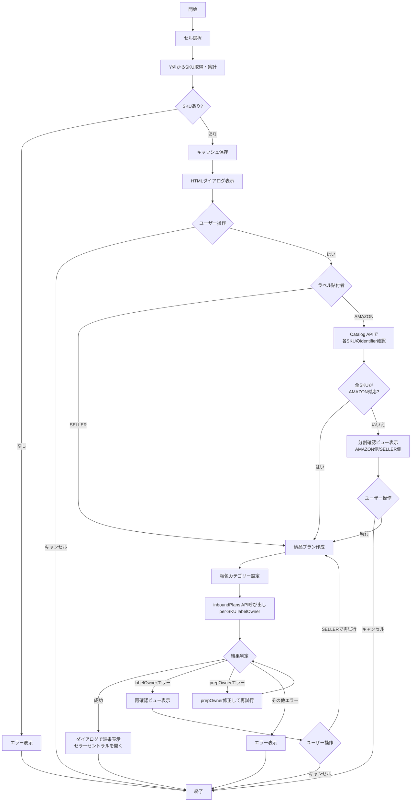

# FBA管理

FBA（Fulfillment by Amazon）納品プラン作成およびラベル生成機能。

## 対応ファイル

| ファイル名 | 役割 |
|-----------|------|
| spapi_Shipment.js | FBA納品プラン作成（サーバ処理） |
| spapi_ShipmentDialog.html | 納品プラン作成確認ダイアログ |

---

## FBA納品プラン作成

### 概要

スプレッドシートの選択行からSKUを取得し、SP-API Fulfillment Inbound APIを使用してFBA納品プランを作成する。

### 処理フロー

### メイン関数

**関数**: spapi_createShipmentPlan

**処理内容**:
1. 選択範囲からY列のSKUを取得・集計
2. SKU集計結果をユーザーキャッシュ（10分間）に保存
3. HTMLダイアログを表示し、SKU一覧とラベル貼付者の選択UIをユーザーに提示
4. ダイアログからの呼び出しに応じて、SP-APIで納品プランを作成
5. 作成成功時、ダイアログ上で結果を表示しセラーセントラルを新しいタブで開く

### 確認ダイアログ

**ファイル**: spapi_ShipmentDialog.html

**提供UI**:
- SKUと個数の一覧表示（スクロール可）
- 合計種類数・合計個数の表示
- ラベル貼付者の選択（ラジオボタン）
  - Amazonに貼付を依頼（有料）：デフォルト選択、`labelOwner: AMAZON` を送信
  - 自分で貼付する：`labelOwner: SELLER` を送信
- 「はい」「キャンセル」ボタン

**サーバ連携関数**:

| 関数 | 用途 |
|------|------|
| spapi_getCachedSkuCounts | キャッシュからSKUデータを読み込み、ダイアログに表示 |
| spapi_submitShipmentPlan | ラジオ選択値を受け取り納品プランを作成、結果を返却 |
| spapi_confirmLabelSplitAndSubmit | 分割確認後、キャッシュされたlabelOwnerMapで送信 |

**返却ステータス**:

| status | 内容 |
|--------|------|
| success | 作成成功。inboundPlanId、sellerCentralUrl を含む |
| labelSplit | Amazon貼付不可SKUが混在。amazonSkus、sellerSkus、unknownSkus を含む |
| labelError | APIエラー発生時のフォールバック。failedSkus、rawMessages を含む |

### Amazon貼付可否の事前判定

ユーザーが「Amazonに貼付を依頼」を選択した場合、納品プラン作成前に各SKUに対して以下の処理を実行する。

**関数**: spapi_classifySkusByLabelEligibility_

**処理内容**:
1. 各SKU文字列からASIN（B + 9英数字）を正規表現で抽出
2. Catalog Items API v2022-04-01 を呼び出し、`includedData=identifiers` でバーコード情報を取得
3. identifierTypeに JAN / EAN / UPC / ISBN / GCID / GTIN のいずれかが存在すればAmazon貼付対応と判定
4. 全SKUを以下の3グループに分類
   - AMAZON対応: labelOwner=AMAZON
   - AMAZON非対応: labelOwner=SELLER（自動切替）
   - ASIN抽出不可: labelOwner=SELLER（フェイルセーフ）

**レート制限対応**: Catalog Items APIは2 rpsのため、2件ずつのバッチに分割し `UrlFetchApp.fetchAll` で並列取得する。各バッチ間に600ms待機することで 2 rps を遵守する。バッチ内で429が返った場合は指数バックオフ（1000ms→2000ms）で最大2回リトライする。

**キャッシュ戦略**: ASIN単位で identifier 取得結果を `CacheService.getScriptCache()` に保存する（TTL 600秒）。キーは `spapi:catalog:ident:v1:<ASIN>` 形式。同一セッション内の再実行時はキャッシュヒット分の API 呼び出しをスキップする。identifier が空配列のASINも negative cache として同TTLで保持する。

**関連関数**:

| 関数 | 用途 |
|------|------|
| spapi_extractAsinFromSku_ | SKU文字列からASINを正規表現で抽出 |
| spapi_parseIdentifierTypes_ | Catalog APIレスポンスからidentifierTypeを抽出 |
| spapi_getCachedIdentifiers_ | 単一ASINのキャッシュ取得 |
| spapi_putCachedIdentifiers_ | ASIN単位でキャッシュへ保存 |
| spapi_getCachedIdentifiersBulk_ | 複数ASINのキャッシュを一括取得（hit/miss分離） |
| spapi_fetchAsinIdentifiersBatch_ | Catalog APIをバッチ並列呼び出しで取得（UrlFetchApp.fetchAll使用） |
| spapi_getAsinIdentifiers_ | Catalog APIでidentifierType一覧を取得（単一ASIN、デバッグ用途で残置） |
| spapi_isAsinAmazonLabelEligible_ | スキャン可能なバーコード有無を判定（単一ASIN、デバッグ用途で残置） |

### 分割確認ダイアログ

Amazon貼付不可SKUが1件でも検出された場合、以下の情報を表示してユーザーに確認を求める。

- Amazon貼付で送信するSKU一覧（件数・個数）
- 自分で貼付するSKU一覧（件数・個数）
- ASIN抽出不可SKU一覧（存在する場合）

「続行」ボタンで確定、「キャンセル」で中止する。

### SKU取得

**関数**: getSelectedSkus_

**処理内容**:
- getActiveRangeList()で飛び飛び選択（Ctrl+クリック）にも対応
- isRowHiddenByFilter()でフィルター非表示行を除外
- 選択された行のY列（25列目）からSKUを取得
- 同じSKUは個数をカウント
- 空のセルはスキップ

### 梱包カテゴリー設定

**関数**: setPrepDetails_

**API**: POST /inbound/fba/2024-03-20/items/prepDetails

**処理内容**:
- 全SKUの梱包カテゴリーをNONEに設定
- prepTypes: ITEM_NO_PREPを指定

**理由**: 一部のSKUではprepOwnerの指定が不要なため、事前にNONEを設定しておくことでエラーを回避

### 納品プラン作成

**関数**: createFbaInboundPlan_

**API**: POST /inbound/fba/2024-03-20/inboundPlans

**リクエストボディの主要項目**:
- destinationMarketplaces: マーケットプレイスID
- items: SKU・数量・prepOwner・labelOwner・expiration
- sourceAddress: 出荷元住所
- name: 納品プラン名（日時を含む）

**items配列の構成**:

| 項目 | 値 | 説明 |
|-----|-----|------|
| msku | SKU文字列 | 出品者SKU |
| quantity | 数値 | 個数 |
| prepOwner | SELLER/NONE | 梱包責任者 |
| labelOwner | AMAZON/SELLER | ラベル貼付責任者（**SKUごとに個別指定可能**） |
| expiration | yyyy-MM-dd | 消費期限（3ヶ月後） |

labelOwnerはSKUごとに混在可能で、同一納品プラン内で「SKU A: AMAZON」「SKU B: SELLER」のように指定できる。

### labelOwnerエラーの検出と再確認

**関数**: spapi_detectLabelOwnerError_

**処理内容**:
- labelOwner=AMAZON 指定時、APIから400エラーが返った場合のみ実行
- エラーメッセージから「Amazon貼付非対応」を示すキーワードを検出
- 対象となるSKUをエラーメッセージから抽出
- 該当ありの場合、ダイアログへ `status: labelError` と該当SKU一覧、生エラーメッセージを返却

**ダイアログでの再確認**:
- Amazon貼付不可SKU一覧と生エラーメッセージ（折りたたみ表示）を提示
- 「自分で貼付で再試行」ボタンで全SKUを `labelOwner: SELLER` に切り替えて再試行
- 「キャンセル」ボタンでダイアログを閉じる

**SKU抽出が失敗した場合**: SKUを特定できなかった旨を表示しつつ、再試行/キャンセルの選択肢を提供

### prepOwnerエラーの自動リトライ

**関数**: handlePrepOwnerError_

**処理内容**:
- エラーメッセージから「prepOwner不要」のSKUを検出
- 該当SKUのprepOwnerをNONEに変更
- リクエストを再構築して再試行

### 出荷元住所

**関数**: getSourceAddress_

**スクリプトプロパティから取得する住所情報**:

| プロパティ名 | 必須 | 説明 |
|-------------|-----|------|
| SHIP_FROM_NAME | 必須 | 発送者名 |
| SHIP_FROM_ADDRESS_LINE1 | 必須 | 住所1 |
| SHIP_FROM_ADDRESS_LINE2 | 任意 | 住所2 |
| SHIP_FROM_CITY | 必須 | 市区町村 |
| SHIP_FROM_STATE | 任意 | 都道府県 |
| SHIP_FROM_POSTAL_CODE | 必須 | 郵便番号 |
| SHIP_FROM_COUNTRY_CODE | 任意 | 国コード（デフォルト: JP） |
| SHIP_FROM_PHONE | 必須 | 電話番号 |

### 結果表示

**処理内容**:
1. サーバが納品プランIDを含む `status: success` をダイアログへ返却
2. セラーセントラルの納品プラン画面URLを生成
3. ダイアログが `window.open` で新しいタブを開く
4. アラートで納品プランIDを通知しダイアログを閉じる

**セラーセントラルURL形式**:
https://sellercentral.amazon.co.jp/fba/sendtoamazon/confirm_content_step?wf={inboundPlanId}

---

## 使用API一覧

| API | バージョン | エンドポイント | 用途 |
|-----|---------|--------------|------|
| Fulfillment Inbound API | 2024-03-20 | /inbound/fba/2024-03-20/inboundPlans | 納品プラン作成 |
| Fulfillment Inbound API | 2024-03-20 | /inbound/fba/2024-03-20/items/prepDetails | 梱包カテゴリー設定 |
| Catalog Items API | v2022-04-01 | /catalog/2022-04-01/items/{asin} | ASINのidentifier取得（Amazon貼付可否判定） |
| FBA Inventory API | v1 | /fba/inventory/v1/summaries | SKU詳細情報取得 |

---

## スクリプトプロパティ設定

FBA管理機能を使用するには、以下のスクリプトプロパティを設定する必要がある。

### 認証情報（共通）

| プロパティ名 | 必須 | 用途 |
|-------------|-----|------|
| LWA_CLIENT_ID | 必須 | LWAクライアントID |
| LWA_CLIENT_SECRET | 必須 | LWAクライアントシークレット |
| LWA_REFRESH_TOKEN | 必須 | LWAリフレッシュトークン |
| LWA_TOKEN_ENDPOINT | 必須 | LWAトークンエンドポイント |
| SELLER_ID | 必須 | セラーID |
| MARKETPLACE_ID | 必須 | マーケットプレイスID |
| SP_API_ENDPOINT | 必須 | SP-APIエンドポイント |

### 出荷元住所（納品プラン作成のみ）

| プロパティ名 | 必須 | 用途 |
|-------------|-----|------|
| SHIP_FROM_NAME | 必須 | 発送者名 |
| SHIP_FROM_ADDRESS_LINE1 | 必須 | 住所1 |
| SHIP_FROM_ADDRESS_LINE2 | 任意 | 住所2 |
| SHIP_FROM_CITY | 必須 | 市区町村 |
| SHIP_FROM_STATE | 任意 | 都道府県 |
| SHIP_FROM_POSTAL_CODE | 必須 | 郵便番号 |
| SHIP_FROM_COUNTRY_CODE | 任意 | 国コード（デフォルト: JP） |
| SHIP_FROM_PHONE | 必須 | 電話番号 |

---

## デバッグ機能

### Script Properties確認

**関数**: checkScriptProperties

**用途**: 設定されているスクリプトプロパティの状況を確認

### SP-API接続テスト

**関数**: testSpApiConnection

**用途**: アクセストークン取得のみを実行し、SP-APIへの接続を確認
